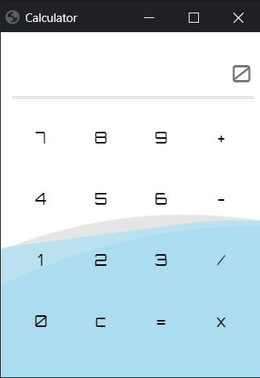

# calculator-using-electron-PythonLib
Simple Calculator using Eel Python Library (Electron-like offline HTML/JS GUI with full access to Python capabilities and libraries).

# Getting Started
  * Clone the repo and cd into the directory \
`$ git clone git@github.com:m-yash/calculator-using-electron-PythonLib.git` \
`$ cd calculator-using-electron-PythonLib`
  * Install eel, pyqrcode, and pyinstaller \
`$ pip install eel`
  * Run the app \
`$ python QRCode.py`
